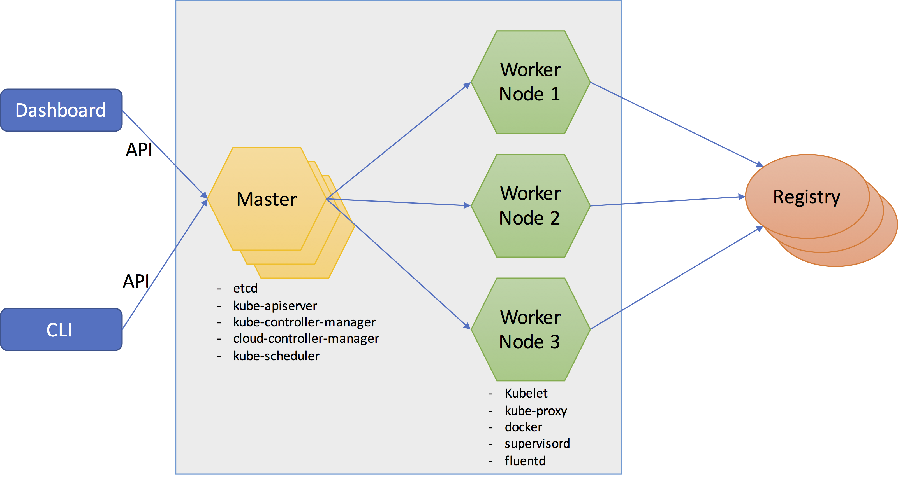

# <a id="toc"></a>Table of Contents
- [Introduction](#intro)
  - [Introduction to Kubernetes Architecture](#arch)
  - [Brief history](#history)
  - [Kubernetes Components](#k8s_comps)
  - [Kubernetes Objects](#k8s_objs)
- [Hands-on](#hand-on)
  - [Create an App Deployment](#create-dep)
  - [Dashboard](#dashboard)
  - [SSH into _minikube_](#minikube-ssh)
  - [Examine API Server Endpoint](#api-server)
  - [Minikube logs](#minikube-logs)
  - [Manifests](#manifests)
  - [Namespaces](#namespaces)
  - [Policies](#policies)
  - [Deployments & Replicasets](#dep-rs)
  - [Update History](#update-history)
  - [Services](#services)
  - [Configmaps](#configmap)
  - [Secrets](#secrets)
  - [Volumes](#volumes)
- [Helm](#helm)


# <a id="intro"></a>Introduction
In this section we will briefly talk about Kubernetes to gain a general understanding of how it works and what it offers.

## <a id="arch"></a>Introduction to Kubernetes Architecture
In a Kubernetes deployment there are two kinds of _nodes_: master and worker. A master _node_ is responsible for maintaining the state of the cluster and provide services to the worker nodes to run applications. The worker nodes actually run the application.

Various processes in the master and worker nodes make up the _Kubernetes Control Plane_

> The name Kubernetes originates from Greek, meaning _helmsman_ or _pilot_, and is the root of _governor_ and _cybernetic_.



## <a id="history"></a>Brief history
Borg started as an internal Google project early 2000, when there was not much even VM adoption, and they wanted to create this highly flexible and expandable infrastructure.
Borg contributed cgroups to linux, then linux create LXC, and then docker made it easier, and now OCI

## <a id="k8s_comps"></a>Kubernetes Components
- __Scheduler__ (master): this process takes requests for executing containers, looks for available nodes, and schedules to run on available nodes
- __Controller Manager__ (master): this process runs a control loop to ensure the declared state matches the current running state (desired state to observed state)
- __API server__ (master): an http based REST API provider the provides access to all the objects and configuration within the cluster.
- __Etcd__: this process keeps track of the state of the cluster. Things like how many pods with their corresponding containers are running, where they are running, what they are running... (distributed store, with replication, in a cluster).
- __Kubelets__ (node): is the main agent process on the nodes, that communicates with the master node
- __Service/Kube Proxy__ (node): this process manages ip tables on the worker nodes, to find a route towards the pod and container providing the service

### Background
- _cgroups_: constrain resources, like cpu and memory used by a process
- _namespaces_: like file system, process id, network, where processes run in these namespaces and don't mix

You can find more details and documentation at: https://Kubernetes.io

## <a id="k8s_objs"></a>Kubernetes Objects
The following are the fundamental objects that we will look at in this tutorial.
- _Pod_: smallest unit that represents a running process in your cluster. A _pod_ is a group of one or more containers, with shared storage/network, and a specification for how to run the containers (like an application-specific logical host). A Controller can create and manage multiple Pods, handling replication, rollout and self-healing at cluster scope (e.g. Deployment, SteatefulSet, DaemonSet)
- _Service_: an abstraction which defines a logical set of _Pods_ and a policy by which to access them (using label selectors)
- _Volume_: to enable persistence storage for containers
- _Namespace_: virtual clusters (_namespaces_) backed by the same physical cluster. Useful with many users spread across multiple teams, or projects. A way to divide cluster resources for multiple uses (via resource quota). Use labels to distinguish resources within the same namespace

We will also look at some of the higher-level objects like _Deployments_ and _ReplicaSets_

# <a id="hand-on"></a>Hands-on
We will use _minikube_ in this exercise, which offers a single _node_ cluster of a Kubernetes deployment. It also enables some of the features that would require additional effort to enable in a clustered environment created from scratch.

Installation documents for _minikube_: https://kubernetes.io/docs/tasks/tools/install-minikube/

This is a quick tour of creating some fundamental objects and see how we can deploy a simple app in Kubernetes.

## <a id="create-dep"></a>Create an App Deployment
Now that we know what _nodes_ and _pods_ are, let's see the commands to list them

List the nodes: we only see the _minikube_ node
```
kubectl get nodes
```
List the _pods_: since we don't have any _pods_, there are no resources to show
```
kubectl get pods
```

Let's install a simple Node.js and Express based application.

A quick way of installing a containerized app is using the following command
```
kubectl run api-in-mem --image=sgdpro/sample-app:in-mem
```
You see a respone like below:
```
deployment "api-in-mem" created
```

Let's see what got created
```
kubectl get pods
```
We can see that a new _pod_ is created, which has a generated ID in its name.

Let's see what else got created
```
kubectl get deployments
```
We can see that a deployment was also created with this command.


Now that we have this app running in a _pod_, how do we access the service that is running in it?

To gain access, we will have to create a _service_ so that we will have an endpoint to access it.
Let's create a _service_ for this app.
```
kubectl expose deployments api-in-mem --port=3080 --type=NodePort
```
So let's see what got created
```
kubectl get service
```
We can see there is a new service for this deployment

Since we are running on minikube, let's access this app in a browser
```
minikube service api-in-mem
```

So now we have a pod, that is running our container that has our app and is exposed as a service.

Let's see how we can log into this container and explore what is in it. We want to get a command prompt into the container.
Use the output from the `kubectl get pods` command and find the name of the _pod_ we want to connect to
Using the _pod_ name, we will run the following command (replace your _pod_ name with _api-in-mem-2663835528-xl2kz_)
```
kubectl exec -ti api-in-mem-2663835528-xl2kz -- /bin/bash
```
>_Convenience:_ you could use the command ``kubectl exec -ti `kubectl get pods | grep -o "api-in-mem-\w*-\w*"` -- /bin/bash`` to skip finding the exact single pod name the same effect. This will work only in this scenario where we have a single _pod_

Maybe change into the app directory (if not already there) at `cd /usr/src/sampleApp` and see the contents of the files that makes up the app. Execute the `exit` command to exit container.

What if we want to see the logs for this container?
We can run a command like below:
```
kubectl logs api-in-mem-2663835528-xl2kz
```
Or conveniently use ``kubectl logs `kubectl get pods | grep -o "api-in-mem-\w*-\w*"`    ``

## <a id="dashboard"></a>Dashboard
Minikube comes with a simple dashboard for managing the environment.

Let's start the dashboard:
```
minikube dashboard
```
The dashboard web app opens in your default browser at http://192.168.99.100:30000/#!/overview?namespace=default URL. We can explore the available objects, and see what we created so far, as _pods_, _services_ and _deployments_.

## <a id="minikube-ssh"></a>SSH into _minikube_
Minikube uses a VM where Kubernetes is installed and running. To access this VM you will have to ssh into that server.
Let's explore the VM image where Kubernetes is running. Run the following command to open a terminal into your _minikube_ VM:
```
minikube ssh
```
In the command line in _minikube_ VM, explore the processes and docker images that are running. Once complete exit the ssh session by execuring the `exit` command


## <a id="api-server"></a>Examine API Server Endpoint
We can also explore what Kubernetes APIs are available, to interact with the objects they represent

In your current terminal tab type
```
kubectl proxy --port=8080
```
This will start a proxy to your services in your cluster

Open a new terminal tab and execute the following command
```
curl http://localhost:8080/api/v1 | less
```
Examine the list of the available objects and the verbs that can be applied to them

### Examine API Server Endpoint - Alternative Approach
An alternative approach is to execute the following command to generate a token:
```
kubectl describe secret $(kubectl get secrets | grep default | cut -f1 -d ' ') | grep -E '^token' | cut -f2 -d':' | tr -d '\t'
```
Copy the token in the clipboard, then execute `minikube ssh` to ssh into the _minikube_ VM, and enter the following command
```
curl https://localhost:8443/api/v1 --header "Authorization: Bearer <paste-token-here>" --insecure
```
You will see the same API information as before

Exit the _minikube_ shell by using the `exit` command

## <a id="minikube-logs"></a>Minikube logs
We can also see the logs for minikube to see how the minikube process itself is doing
Let's run the following command to see the logs
```
minikube logs
```

## <a id="manifests"></a>Manifests
Kubernetes uses manifest files to capture the definitions of various Kubernetes objects, like _pods_, _services_...

Let's create a _pod_ using a manifest. Save the following content in a file called `mypod.yaml`. You can also find the file in the repository at `manifest-files/mypod.yaml` path.

```yaml
apiVersion: v1
kind: Pod
metadata:
  name: mypod
spec:
  containers:
  - image: nginx
    name: nginx
```

Now we will use the above definition to create a new _pod_, which will be called _mypod_.
This new pod will be using nginx as its container image (just to keep things simple).

To create this _pod_ we will use the following command (ensure the path to the file is correct)
```
kubectl create -f mypod.yaml
```

So let's get the list of _pods_ and see if it got created:
```
kubectl get pods
```

We can see that our new _mypod_ _pod_ is created and is listed.

> __Note:__ there is no generated ID appended to the _pod_ name, it simply says _mypod_ as shown in the yaml file

Let's examine the contents of the _pod_'s manifest after it is created and Kubernetes has augmented the entries

To do this, we can run the command below
```
kubectl get pods mypod -o yaml
```

> __Tip:__ for all such commands that show large content on the console, if you are interested in just viewing the content and do not like to clutter up your console, you can pipe (`|`) the results into `less` or `more` to simplify viewing, like so: `kubectl get pods mypod -o yaml | less`

It is also possible to use a json format instead of yaml format
```
kubectl get pod mypod -o json | jq -r .spec
kubectl get pods -o json | jq -r .items[].spec
kubectl get pods -o json | jq -r .items[1].spec
```

> __Note:__ we are using `jq` which can be found here: https://stedolan.github.io/jq/

If you are trying to find the API URL for an object, like the _pod_ that we just created, you can get it by running the following command and finding the API URL in the returned details
```
kubectl get pods -v=9 mypod
```
In the results from the above command you will find a line like below, which is a `curl` command to reach the object you just queried
```
curl -k -v -XGET  -H "Accept: application/json" -H "User-Agent: kubectl/v1.7.0 (darwin/amd64) kubernetes/d3ada01" https://192.168.99.100:8443/api/v1/namespaces/default/pods/mypod
```

You can try the URL by setting up the proxy using `kubectl proxy --port=8080` and running a `curl` command like above by replacing the first part of the URL with `http://localhost:8080`
```
curl http://localhost:8080/api/v1/namespaces/default/pods/mypod
```

> __Tip:__ you can pipe the results to `jq` to see a nicely formatted json object: `curl http://localhost:8080/api/v1/namespaces/default/pods/mypod | jq`

## <a id="namespaces"></a>Namespaces
Objects are created either in the _default_ namespace, or in a specific user defined namespace

When we run the following command, we only get the _pods_ in the _default_ namespace
```
kubectl get pods
```

If we want to see all the pods in a spceific _namespace_ we can use `--namespace`
```
kubectl --namespace default get pods
```
The above command shows the _pods_ in the _default_ namespace, while the command below will show the _pods_ in the _kube_system_ namespace
```
kubectl --namespace kube-system get pods
```

If we want to see all the _namespaces_ we will have to run
```
kubectl get pods --all-namespaces
```

The results of the above command show that there are other _namespaces_ that we didn't see earlier.
Most of these other objects are in the Kubernetes system namespace, because if you do not specify the namespace, it will be _default_ namespace

So lets' see what _namespaces_ are currently available, run the command below
```
kubectl get namespace
```

So now, let's create a new namespace and then update the _pod_ definition we had earlier and put it in a new _namespace_

Create a new _namespace_ can call it _mydev_
```
kubectl create namespace mydev
```

Now use this new _namespace_ and create a new _pod_ in this _namespace_.
First create a file (let's call it `mydev_mypod.yaml`) that contains the following content
```yaml
apiVersion: v1
kind: Pod
metadata:
  name: mypod
  namespace: mydev
spec:
  containers:
  - image: nginx
    name: nginx
```

As you can see it has _mydev_ as the _namespace_, and then run the following command to create this new _pod_
```
kubectl create -f mydev_mypod.yaml
```

> __Tip:__ to set the namespace for all the subsequent `kubectl` command you can use this command: `kubectl config set-context $(kubectl config current-context) --namespace=your_namespace`. You can verify using command: `kubectl config view | grep namespace:`

As you can see this new pod has the same name as the previous one (namely `mypod`), but we don't see any error messages because they are in different _namespaces_ therefore there is no conflict.

In addition to viewing the manifest of an object, we can also update the object in place, using `kubectl edit` command. However this is generally not considered a good idea because you are updating an object on the fly and the manifest files that are checked into source control will be out of sync with what is currently running. Instead you would want to update the corresponding manifest file and then use the `kubectl apply` command to update it.

> __Note:__ The `kubectl create` command creates a new object, however `kubectl apply` is used to patch or make an update to the existing object

Now let's delete the _pod_ in the _default_ _namespace_
```
kubectl delete pods mypod
```

> __Tip:__ if you were planning to delete the _pod_ in the _mydev_ _namespace_, you would have used the `-n` (or `--namespace`) switch to pass the _mydev_ _namespace_ to the command.

> __Note:__ not everything is in a namespace: namespaces themselves and other low-level resouces like _nodes_ and persistent volumes are not in a namespace

## <a id="policies"></a>Policies
You can use policies to enforce certain conditions and criteria. These can be restriction on network communication, for example block traffic between _namespaces_. Or you can define resource quotas.

In this example we will create a resource quota that restricts the creation of _pods_ to a single one in the _mydev_ _namespaces_. This will stop any more _pods_ from being created in the _mydev_ _namespace_.

Let's create this resource quota. First create a file (call it `mydev_pod_quota.yaml`) and put the following content in the file:
```yaml
apiVersion: v1
kind: ResourceQuota
metadata:
  name: counts
  namespace: mydev
spec:
  hard:
    pods: "1"
```

As you can see the object kind is _ResourceQuota_, we are calling this object _count_ and we are setting up the specification to say we have a _hard_ limit for _pods_ with a count of 1.

So let's create this resource:
```
kubectl create -f mydev_pod_quota.yaml
```
So now if we try to create any other _pod_ in the _mydev_ namespace we will see an error message complaining that the quota is exceeding the limit.

To see this in action, get a copy of the `mydev_mypod.yaml` file and change the name to something else (e.g. `mydev_otherpod.yaml`), because we can't have _pods_ with same name in the same _namepspace_ anyway!. And then create it with the `kubectl create -f mydev_otherpod.yaml` command.

You will see an error similar to this: `Error from server (Forbidden): error when creating "myotherpod.yaml": pods "otherpod" is forbidden: exceeded quota: counts, requested: pods=1, used: pods=1, limited: pods=1`

## <a id="dep-rs"></a>Deployments & Replicasets
This is a brief description of the relationships between these object: _Pods_ are managed by _replicasets_, _resplicasets_ by _deployments_, and _deployments_ are exposed by _services_

When we look at a _deployment_ we know how many _pods_ are running and which versions/images of the containers they are running. This is achieved by the relationship between a _deployment_ and the _replicaset_. There can be many _replicasets_ for the _pod_, which track the different versions of the containers in the _pod_.

So when I scale a _deployment_, I am changing the _replicaset_ count for it, which increases the number of _pods_. I can change the scale of a _pod_ using the following command:
```
kubectl scale deployments api-in-mem --replicas=4
```
verify that above by listing the pods:
```
kubectl get pods
```
You can see that now we have 4 pods running the app. And since I have exposed the service as _NodePort_, I can access the app on any of the _pods_, with their port number.


> __Note:__ recall from the first step that we created this deployment (i.e. _api-in-mem_) with the `run` command, which automatically creates a _deployment_ for us. However, when we created _mypod_ _pod_, we just created a _pod_ on its own that belongs to no deployment (generally not what we want!).


We can also directly create a _deployment_, which behind the scene creates a _ReplicaSet_ as well.
Copy the following yaml into a file and call it `mydeployment.yaml`
```yaml
apiVersion: apps/v1beta1
kind: Deployment
metadata:
  name: api-in-file-deployment
  labels:
    app: api-in-file
    appvariant: filebased
spec:
  replicas: 3
  selector:
    matchLabels:
      app: api-in-file
      appvariant: filebased
  template:
    metadata:
      labels:
        app: api-in-file
        appvariant: filebased
    spec:
      containers:
      - name: api-in-file
        image: sgdpro/sample-app:in-file
        ports:
        - containerPort: 3080
```
In the above manifest, the _template_ part of the _spec_ is defining a _pod_. This _pod_ is based on a container image of our first api app, but with a different tag.

Use the above file and create the deployment:
```
kubectl create -f mydeployment.yaml
```

> __Labels:__ unique key value pairs added to an object that mean something to the user, and are used to group or select resources. They have to be simple values, and mean something. If you have information that doesn't identify/classify (e.g. just information), then use *annotations*. You can use _equality based_ `=`, `==` or `!=` or _set based_ check like `in`, `notin` and just use the key (`mykey` or `!mykey`), an example of a set based label can be `mykey in (val1, val2)`

One of the things that a _replicaset_ is responsible for is to find the _pods_ that match a specific label, and make sure that the desired count matches the observed count in the cluster. If there is a discripancy, then it will either add or terminate _pods_ to make the state consistent (i.e. desired to be same as observed).

So in the above _deployment_, you can see that we are defining the following:
- we want 3 replicas or instances of this _pod_
- a label selector for `appvariant=filebased`
- a _pod_ definition that is based on our api sample image with a different tag
- the _pod_ in this _replicaset_ defines a label as `appvariant: filebased`

Let's examine what got created
First check the _pods_ (list the labels as well):
```
kubectl get pods --show-labels
```
So as you can see from the output of the `get pods` command above, we have three _pods_ that have the `appvariant=filebased` label.

Now check the _replicasets_:
```
kubectl get rs
```
Similar to _pods_, we have 3 _replicasets_

Now check the _deployments_:
```
kubectl get deployments
```

To demonstrate how the _deployments_, through the help of the controller manager, ensure that the desired and observed states match, we will change the label of one the _pods_ and watch how Kubernetes starts a new _pod_ to ensure that we always have the expected 3 _pods_ as defined by the replica count

Since this is an experiment for demo purposes, we will directly update the manifest of the _pod_ on the fly.
Choose the name of the one of the _pods_ from the earlier `get pods` command, and update the label by changing the `appvariant: filebased` to `appvariant: memorybased`.
You could do this in two ways, one option is to use the `kubectl edit pod <pod_inst_name> -o yaml`, which will open the manifest in `vi`, and change the label from memorybased to filebased, and save and exist `vi`, or the other simpler option is to use the following command (replace the _pod_ name with one of your _pod_ names)
```
kubectl label pod api-in-file-1358977376-0wcxq appvariant=memorybased --overwrite
```
Now if you look at the list of the _pods_ you will see a new one was created to ensure that the overall count of _filebased_ _pods_ doesn't go below the desired state of 3 as defined in the _deployment_.
```
kubectl get pods --show-labels
```

> __Note:__ When the `kubectl run` command is used to start a new image, it automatically creates a label as `run=<yourimageName>` which is used by the corresponding _replicaset_. Try exploring what objects got created after running the first command  `kubectl run api-in-mem --image=sgdpro/sample-app:in-mem`.

## <a id="update-history"></a>Update History
I can see the history of changes that I have made to my deployment.

Let's make the change below:
```
kubectl set image deployment/api-in-file api-in-file=nginx
```

I can run the command below and see the changes made to the _replicaset_
```
kubectl rollout history deployment api-in-file
```
You can see the _replicaset_ changes in a numbered list

So if you make a bad change, say you apply a change to update the container image (e.g. `kubectl set image deployments nginx nginx=nginx:6.10.1`), and have a typo in your image name, then the deployment will fail, or there is bad code in your latest deployment and you want to roll back. You can use a command like below:
```
kubectl rollout undo deployment api-in-file --to-revision=1
```
In this case the command will roll back and use the _replicaset_ from the first _deployment_

To see the rollout status, run:
```
kubectl rollout status deployment/api-in-file
```

> __Note:__ the CHANGE-CAUSE column currently shows **<none>**, if you want it to be something meaningful, you either use the --record option on the `run` command, or you can annotate the object. Any object can be annotated. For example I could annotate the above _deployment_ using a command like `kubectl annotate deployment api-in-file kubernetes.io/change-cause="My new annotation"`. To verify, use `kubectl rollout history deployment api-in-file` command see the change cause updated

## <a id="services"></a>Services
So far we have deployed our application and scaled it, and saw how Kubernetes maintains the desired count of the running applications.
Not all services need to reachable from outside the cluster. For example if you have a _redis_ cluster, most likely is a cache provider for the services in the same cluster where it is. Or maybe in a more elaborate scenario it could be a common service across one or multiple _namespaces_. However it would be unlikely to require direct access to your _redis_ cluster from outside. But there are services or endpoints, like your load balancer (e.g. nginx) that would be required to have an external endpoint. Let's see the options available to us to expose a service.

One of the options, that we saw earlier, is _NodePort_, which is readily available in _minikube_. In one of the earlier examples we exposed a _deployment_ using a command like below:
```
kubectl expose deployments api-in-mem --port=3080 --type=NodePort
```
Here we define the port and type of the service, in this case _NodePort_.

The above _service_ also has an _endpoint_ object. To see the _endpoints_ run the following command
```
kubectl get endpoints
```
You can see a single _endpoint_ listed for this service

For simplicity, let's start from a simple nginx image and try to work through an example to see how _services_ work

Let's first create an nginx deployment
```
kubectl run mynginx --image=nginx
```
So with this command, we created a specific instance of a _pod_ and a _replicaset_, and a _deployment_ that is called _mynginx_ (you can see these by running `get pods`, or `get deployments` or `get replicasets` command)

We will expose this nginx service on its port 80
```
kubectl expose deployment mynginx --port=80 --type=NodePort
```
If we run `get services`, we will see a new _service_ and we can also see a new _endpoint_ (using `get endpoints`)

Let see what labels the _pods_ have
```
kubectl get pods --show-labels
```
You can see that the _pod_ created for the _mynginx_ _deployment_ has a couple of labels, and one of them is `run=mynginx`.

We can also selective show _pods_ with a specific label like below:
```
kubectl get pods -l run=mynginx
```

Let's scale up the _mynginx_ _deployment_ to have 3 _pods_
```
kubectl scale deployment mynginx --replicas=3
```
If you run `get pods` you will see 3 _pods_. Or if you run `get endpoints` you will see three endpoints listed for this service.

So the above _service_ creation resulted in 3 pods with a random high port number. If I run `minikube service mynginx`, my default browser opens with the _minikube_ VM's IP address and the generated port number. I can see that port number by examining the _service_ definition in the _NodePort_ property:
```
kubectl get service mynginx -o yaml
```
Or simply using `kubectl get services` and examining the ports column in the result

So how does this work? The Kubernetes proxy process in the _node_ is listening to incoming traffic. This proxy process has re-written the ip table of the _node_ and any incoming network traffic on the specific virtual IP, is routed to a _pod_ that hosts that _service_. The selection of the _pod_ is performed by a label selector (e.g. `run=mynginx`), and the private IP of the _service_'s _endpoint_ is determined from the _endpoints_ object of the service. So this way an external static endpoint IP that can be access externally is mapped to one of the available internal _service_ implementation endpoint.

There are other configuration options on the _service_. The _ClusterIP_ option, which is the default if you do not specify it, makes the _service_ only reachable from within your private cluster. For example this can be used for the _redis_ or any other database service that should only be accessed from within your cluster. To see this option, you inspect the manifest of a _service_ using the `kubectl get service nginx -o yaml` command.

In the case of using _NodePort_, your Kubernetes _nodes_ need to be reachable and you would want to have a loadbalancing option in front of your services. For example your _nodes_ are accessible inside your own internal network, and you provision a loadbalancer to expose the _nodes_ to the external users. Probably not what you want to do for real services. This is just good for developer environment and maybe some exploration scenarios.

The other options is a _LoadBalancer_ type, which is specific to your cloud provider like AWS, Google Cloud Engine (GCE), etc. This cannot be tried on _minikube_, as the external IP address remains in `pending` state
```
kubectl run nginx2 --replicas=2 --labels="run=nginx2-for-lb" --image=nginx --port=80
kubectl get pods --selector="run=nginx2-for-lb"
kubectl get replicasets --selector="run=nginx2-for-lb"
kubectl expose rs nginx2-595856322 --type="LoadBalancer" --name="nginx2-service"
kubectl get services nginx2-service
```
### Ingress
There is one more option which is called _ingress_. This option is useful when you are deploying into a set of VMs of your own (most likely on premises), and you want to expose the services running in your cluster. This approach works with a loadbalancer (like nginx, HAProxy or Traefik) that gets automatically updated with the upstream server definitions.

Configuring _ingress_ and creating an _ingress controller_ is a much broader topic, and there are lots of references to how do this. There are examples that show how you can code one yourself, and also some community effort for creating an ingress controller from some of the popular loadbalancers like Traefik.

In this section we will use the built-in _ingress controller_ provided in _minikube_ to just experiment with how it works.

If you get the _pods_ in all the _namepsaces_ (`kubectl get pods --all-namespaces`) you will see an nginx based _pod_ which starts with _nginx-ingress-controller_.

If you don't see this _pod_ then we will have to enable it. This is done by the add-on manager in _minikube_.

Let's first see a list of the add-ons available. Run `minikube addons list` and see the list of the add-ons and note that _ingress_ is possibly `disabled`.

To enable this add-on, run this command: `minikube addon enable ingress`. And then verify that the _ingress_ _pod_ shows up in the system _namespace_ and is RUNNING state.

Now that we have enabled the _ingress controller_ in _minikube_, let's create an _ingress_ object.

Create a file called `myingress.yaml` and place the following content in it:
```yaml
apiVersion: extensions/v1beta1
kind: Ingress
metadata:
  name: mynginx
spec:
  rules:
  - host: mynginx.192.168.99.100.nip.io
    http:
      paths:
      - backend:
          serviceName: mynginx
          servicePort: 80
```

Let's create the _ingress_ object using the above file:
```
kubectl create -f myingress.yaml
```
After creating the _ingress_ object, you should be able to reach your service from the browser using http://mynginx.192.168.99.100.nip.io url

To further explore how this worked, you can open a shell into the ingress controller _pod_ and check the nginx configuration.
First you need to find the ingress controller _pod_ name using `kubectl get pods --all-namespaces | grep ingress`
```
kubectl exec -it nginx-ingress-controller-kwhw3 -n kube-system -- /bin/bash
cat /etc/nginx/nginx.conf
```
You can scroll up in the content and find where the upstream definition is created for your service
```
    upstream default-mynginx-80 {
        # Load balance algorithm; empty for round robin, which is the default
        least_conn;
        server 172.17.0.10:80 max_fails=0 fail_timeout=0;
        server 172.17.0.12:80 max_fails=0 fail_timeout=0;
        server 172.17.0.5:80 max_fails=0 fail_timeout=0;
    }

...

server {
        server_name mynginx.192.168.99.100.nip.io;
        listen 80;
        listen [::]:80;
        set $proxy_upstream_name "-";
        location / {
            set $proxy_upstream_name "default-mynginx-80";
            port_in_redirect off;

            client_max_body_size                    "1m";
        ...
}
```
Exit from the shell of your ingress controller _pod_ by executing the `exit` command

The `mynginx.192.168.99.100.nip.io` host name is just for convenience to avoid adding _/etc/hosts_ entries in your laptop. Alternatively change the _host_ attribute in ingress yaml file above to something else (e.g. _mynginx_) and add that to your `/etc/hosts` file as an entry like `192.168.99.100  mynginx`, or whatever your minikube IP address is

## <a id="configmap"></a>Configmaps
Applications generally expect configuration data. This configuration is mainly passed to the application (in a container) through environment variables. This configuration also changes based on the deployment target (e.g. Dev server, Test server, Prod server...). For the most part you would enter this information on the command line through command line parameters.

The example below shows how we deploy the Wordpress application, which uses two containers, one for the web portion of the application and another for the MySQL database. Both these containers require some parameters to start correctly.

### Deploy MySQL
First, we are going to deploy the MySQL database. It requires a password for the database, which is passed to the container through *MYSQL_ROOT_PASSWORD* environment variable.
```
kubectl run mysql --image=mysql:5.5 --env MYSQL_ROOT_PASSWORD=root
```
Now we need to expose the database internally (available to the cluster only), which will be referenced by the wordpress web application
```
kubectl expose deployment mysql --port=3306
```
Notice that we called the _service_ _mysql_.

Let's verify that MySQL actually started and that we can log into it.
To do this, we will execute the following command, which shells into the MySQL container, executing the MySQL client command. We are passing the user id on the command line as _root_, and we just use `-p` parameter, so when we execute the command it will ask us for the password, which is _root_. Replace the name of the _mysql_ _pod_ with the instance in your deployment (i.e. use 'kubectl get pods` to find the name)
```
kubectl exec -ti mysql-1883654754-z7km9 -- mysql -uroot -p
```
You can execute the `show databases;` command in the mysql command prompt to see the list of the databases.
Exit the container using `exit` command.

### Deploy Wordpress
The wordpress web application is deployed using the command below, and we are passing two parameters to it, one is the database password, and the other is the host name (i.e. _service_ name) of the MySQL database.
```
kubectl run wordpress --image=wordpress --env WORDPRESS_DB_HOST=mysql --env WORDPRESS_DB_PASSWORD=root
```

However we still can't reach the wordpress application because we haven't exposed it as a _service_, let's do that now:
```
kubectl expose deployment wordpress --port=80 --type=NodePort
```

To verify that everything is working, you can start a browser and log into wordpress, using the `minikube service wordpress`.

> Optional: Go through the configuration steps of the Wordpress and publish a simple blog and see if it is working. Then you can use the command we used earlier to shell into the MySQL container with the MySQL client and verify that the database contains your blog information. On the MySQL command line you can use `use wordpress;` to connect to the right database, and then execute `select * from wp_posts` SQL query and verify you see your blog. Use the `exit` command to get out of the command line interface.

The alternative approach to passing these parameters on the command line is to use a file (e.g. _myconfig.json_ file) that contains these configuration parameters as name-value pairs. Then we can mount the configmap as volume, and then reference parameter names where the environment variables require values. The values of the parameters change based on deployment targets, because different configmaps are mounted. For example you can use this approach to mount the correct nginx.conf file based on deployment target environment.

> __Note:__ it is important to note that this is just a simple example, and config maps are not meant to be used for confidential data. They are better suited for public and general application configuration items that are meant to be externalized to facilitate promotion of the code between different environments. For confidential items you would use _secrets_.

Let's create a file called _myconfig.json_ with the following content:
```json
{
  "dbpwd": "root",
  "dbhost": "mysql"
}
```
We then create a _configmap_ with this file using the following command, and call it _myconfig_:
```
kubectl create configmap myconfig --from-file=myconfig.json
```

We can verify that the _configmap_ is created using the command below
```
kubectl get configmaps
```

You can verify the contents of the _configmap_ using the command below:
```
kubectl get cm myconfig -o yaml
```
You can find the configuration in the _data_ property of the manifest

If you are planning to use a _configmap_ for the MySQL database you could do the following as well:
Create a _configmap_ using literals
```
kubectl create configmap mysqlconfig --from-literal=dbpwd=root
```
And then use a _deployment_ yaml file like below (`mysql.yaml`) to create the MySQL database
```yaml
apiVersion: apps/v1beta1
kind: Deployment
metadata:
  name: mysql
  labels:
    app: mysql
spec:
  replicas: 1
  selector:
    matchLabels:
      app: mysql
  template:
    metadata:
      labels:
        app: mysql
    spec:
      containers:
      - name: mysql
        image: mysql:5.5
        env:
          - name: MYSQL_ROOT_PASSWORD
            valueFrom:
              configMapKeyRef:
                name: mysqlconfig
                key: dbpwd
        ports:
        - containerPort: 3306
```
Notice how the environment variable is passed in the _pod_ template, where an env entry with the correct name is referencing the password

## <a id="secrets"></a>Secrets
If you pass the configuration parameters as environment variables from the command line, then the values will show in clear text in the manifest files. These manifest files are stored in a source control system, so having values like passwords in them is not a good idea.

So let's hide the database password
To do this we create a Kubernetes _secret_ object, using a command like below:
```
kubectl create secret generic mysql --from-literal=password=mypwd
```
Verify it got created using by running `kubectl get secrets`

Now let's see how we can use this secret.
The manifest below defines a _deployment_ called _mysql-secret_, which identifies the container image to use, the `MYSQL_ROOT_PASSWORD` environment variable definition. You can see that the value of the environment variable (in the _secretKeyRef_ property) is taken from a _secret_ object named _mysql_ and uses the value of the entry with a name/key called `password`
```yaml
apiVersion: apps/v1beta1
kind: Deployment
metadata:
  name: mysql-secret
  labels:
    app: mysql-secret
spec:
  replicas: 1
  selector:
    matchLabels:
      app: mysql-secret
  template:
    metadata:
      labels:
        app: mysql-secret
    spec:
      containers:
      - name: mysql
        image: mysql:5.5
        env:
          - name: MYSQL_ROOT_PASSWORD
            valueFrom:
              secretKeyRef:
                name: mysql
                key: password
        ports:
        - containerPort: 3306
```
Copy the above yaml in `mysql-secret.yaml` file create the above _deployment_ using `kubectl create -f mysql-secret.yaml`.

If you run the command below to examine the _pod_, you will notice that the password is not directly in the manifest anymore.
```
kubectl get pods mysql-secret-2959053754-btqhx -o yaml
```

However, if run the command below and examine the _secret_ object itself, I can still see the encoded version of the password. I can simply decode the password on the command line using `echo <encodevalue> | base64 --decode`. 
```
kubectl get secrets mysql -o yaml
```
If secrets are created throug manifest files, these manifest files should not be checked into source control.
> Notice you find the information under the _data_ property in the yaml content of the manifest.

In addition to secrets, there are ways to lock down access on the cluster both from operations and application perspective.
- Role Based Access Control (RBAC): Roles can be defined at _namespace_ or cluster level, which sets up some rules enforcing your policies, for instance a role can only read an object but not update it.
- The other option is to use _namespaces_ and network policies to limit access
- There is also a _pod_ level security, which is called Pod Security Policy. The policies here can enforce things like, don't allow processes to run under `root` user in the container, or what a container can do, like which volumes they can mount, etc. The Pod Security Policy (_psp_) resource is available in _minikube_.

## <a id="volumes"></a>Volumes
Applications need to store content in a persistent storage (e.g. file system), so the same store can be mounted on different containers to gain access to data across restarts of a container (in the same _pod_ or any other _pod_). Also it might be necessary to share files between containers running in the same _pod_.

Kubernetes offers _volumes_ to enable this feature. Users can choose a volume type (https://kubernetes.io/docs/concepts/storage/volumes/#types-of-volumes). Lifecycle of the volumes are tied to the _pod_ they are associated with, so if a _pod_ goes away, the _volume_ does too. If a container restarts in the same _pod_, the _volume_ will still be there, unless the _pod_ goes away.

So in its simplest form, a _volume_ is a directory for holding data, and is backed by whatever the _volume_ type is (`hostPath`, `nfs`...). A _pod_ specifies the _volumes_ (in the `spec.volumes` field) and where to mount those into containers(the `spec.containers.volumeMounts` field).

Two examples we will use are `emptyDir` and `hostPath`. In the case of `emptyDir`, it starts with an empty directory, and it can be mounted in different paths in different containers, but if the _pod_ goes away, so does the contents of it, whereas with `hostPath` the contents stay on the local disk of the host machine (_node_) where the _pod_ is running. So if the _pod_ goes away, you still can access the data in the local disk. And clearly if the disk dies, or the machine goes away, so does the data.

As an example, let's create two _pods_ and mount a _volume_ at different paths, and try to read & write content and verify that two containers in the same _pod_ can see the contents.

Let's start by creating a _pod_ using the manifest below (save the content to a file and call it `myvol.yaml`)
```yaml
apiVersion: v1
kind: Pod
metadata:
  name: myvolpod
  labels:
    app: vol
spec:
  containers:
  - image: busybox
    command:
      - sleep
      - "3600"
    volumeMounts:
    - mountPath: /mypath1
      name: emptyvol
    imagePullPolicy: IfNotPresent
    name: busy1
  - image: busybox
    command:
      - sleep
      - "3600"
    volumeMounts:
    - mountPath: /mypath2
      name: emptyvol
    imagePullPolicy: IfNotPresent
    name: busy2
  restartPolicy: Always
  volumes:
  - name: emptyvol
    emptyDir: {}
```
Notice that we are creating a single _pod_ with two containers, one called _busy1_, and the other _busy2_. We also define a _volume_ called `emptyvol`, and we reference this _volume_ in each _pod_, but mount the _volume_ at different paths (one at `/mypath` and the other at `/mypath2`).

We can now create the above _pod_ using the following command:
```
kubectl create -f myvol.yaml
```
Verify that the _pod_ got created using `kubectl describe pod/myvolpod` command.

Let's verify how this works by adding a file to the mount path of the first container, and then check the mount path in the second container and confirm that we see the file from the first container.

First we list the files in the first container's (`busy1`) mount path
```
kubectl exec -ti myvolpod -c busy1 -- ls -l /mypath1
```
Next we touch an empty file in the mount path of the first container (`busy1`), and verify the file is there
```
kubectl exec -ti myvolpod -c busy1 -- touch /mypath1/afile
kubectl exec -ti myvolpod -c busy1 -- ls -l /mypath1
```
We can now go to the second container (`busy2`) and verify that the file exists there too
```
kubectl exec -ti myvolpod -c busy2 -- ls -l /mypath2
```

### Decoupling Volume Decisions (dev to prod)
Not all decisions can be made at development time. For example we can't decide on the _volume_ type at dev time and put in the manifest. The final solution can run in a public cloud provider or maybe even in house. To address this there are two objects: Persistent Volume Claim (_pvc_) and Persistent Volumes (_pv_).

At development time, the developer only makes a claim using _pvc_ that the app needs a _volume_ of a particular size (e.g. 100MB or 10GB), and at deployment time, the operations team can define _pvs_ that would be used by the _pvcs_ defined by the development team. Sometimes this can be done in an automatic fashion, like what happens in _minikube_ when you create a _pvc_, a corresponding _pv_ gets created using `hostPath` as the volume type.

If we run the following commands, _minikube_ reports that there are no resources
```
kubectl get pv
kubectl get pvc
```

Let's create a persistent volume claim.
Copy the following contents into a file and call it `mypvc.yaml`
```yaml
kind: PersistentVolumeClaim
apiVersion: v1
metadata:
  name: myclaim
spec:
  accessModes:
    - ReadWriteOnce
  resources:
    requests:
      storage: 1Gi
```
We create the _pvc_ using the following command
```
kubectl create -f mypvc.yaml
```
We can now see that after creating only the _pvc_, we also see a _pv_, which got created automatically.
```
kubectl get pvc
kubectl get pv
```

We can now use the above Persistent Volume Claim (_pvc_) and define a _volume_ that reference the _pvc_
Copy the content below in a file and call it `mypod-pvc.yaml`
```yaml
apiVersion: v1
kind: Pod
metadata:
  name: hostpathpod
spec:
  containers:
  - image: busybox
    name: busybox
    command:
    - sleep
    - "3600"
    volumeMounts:
    - mountPath: /mypath
      name: myvol
  volumes:
  - name: myvol
    persistentVolumeClaim:
      claimName: myclaim
```
Now let's create the _pod_
```
kubectl create -f mypod-pvc.yaml
```

So now if we create a file in the given mount path, we will see the file stored and persisted over _pod_ restarts. This is because the _pv_, which was automatically created by _minikube_ uses `hostPath` _volume_ type. You can find the actual path where the file is stored on the host machine by examining the _pv_ using a command like `kubectl get pv <pvcname> -o yaml`, and then you would use `minikube ssh` and find the files in the VM.

# <a id="helm"></a>Helm
Helm is a package manager, and the packages/modules are called charts. https://github.com/kubernetes/helm

> Note: More details for installation can be found here: https://docs.helm.sh/using_helm/#installing-helm

An easier way of defining an entire solution with all its parts and Kubernetes objects that need to be created.

You need two parts to enable the usage of _Helm_
- `helm` is the client portion that runs from where you run `kubectl`
- `tiller` is the server portion that runs in a _pod_ in your cluster

A _chart_, which is a _helm_ package, contains a description for the package, and some templates that contain manifest files. These _charts_ can be shared as files or retrieved from a repository.

After getting the binaries, we need to initialize _helm_, for the cluster. However, before doing that, in recent Kubernetes installations the cluster is created with RBAC enabled, so you would want to create the necessary roles and role bindings to allow the _tiller_ component to interact with the rest of the cluster

First create a service account for your _tiller_ service
```
kubectl create serviceaccount tiller --namespace kube-system
```

Also create the role and role bindings, by saving the contents below in a file (e.g. _tiller-rbac.yaml_)
```yaml
apiVersion: v1
kind: ServiceAccount
metadata:
  name: tiller
  namespace: kube-system
---
apiVersion: rbac.authorization.k8s.io/v1beta1
kind: ClusterRoleBinding
metadata:
  name: tiller
roleRef:
  apiGroup: rbac.authorization.k8s.io
  kind: ClusterRole
  name: cluster-admin
subjects:
  - kind: ServiceAccount
    name: tiller
    namespace: kube-system
```
Then run the command below to create the necessary roles and role bindings
```
kubectl create -f tiller-rbac.yaml
```

Now that the service account is available and the necessary roles are added, you are ready to initialize _helm_
```
helm init --service-account tiller
```

> __Note:__ You can find more details about this configuration at: https://github.com/kubernetes/helm/blob/master/docs/service_accounts.md

Now if you examine the _pods_ (`kubectl get pods -n kube-system`), you will notice a new _tiller_ pod

By default _helm_ is connected to the official stable repository. We can deploy a simple _chart_ to just familiarize ourselves with it

First update the repository
```
helm repo update
```

Let's see a list of all the stable entries
```
helm search
```

Now let's install _wordpress_ like we did before, but this time using a _chart_
```
helm install stable/wordpress
```

You will see an output similar to below
```
NAME:   callous-clownfish
LAST DEPLOYED: Fri Nov  3 13:31:36 2017
NAMESPACE: default
STATUS: DEPLOYED

RESOURCES:
==> v1beta1/Deployment
NAME                         DESIRED  CURRENT  UP-TO-DATE  AVAILABLE  AGE
callous-clownfish-mariadb    1        1        1           0          0s
callous-clownfish-wordpress  1        1        1           0          0s

==> v1/Pod(related)
NAME                                         READY  STATUS   RESTARTS  AGE
callous-clownfish-mariadb-86bc48755c-mb4tr   0/1    Pending  0         0s
callous-clownfish-wordpress-5dc6c6dfd-2c9sp  0/1    Pending  0         0s

==> v1/Secret
NAME                         TYPE    DATA  AGE
callous-clownfish-mariadb    Opaque  2     1s
callous-clownfish-wordpress  Opaque  2     1s

==> v1/ConfigMap
NAME                       DATA  AGE
callous-clownfish-mariadb  1     1s

==> v1/PersistentVolumeClaim
NAME                         STATUS   VOLUME  CAPACITY  ACCESS MODES  STORAGECLASS  AGE
callous-clownfish-mariadb    Pending  1s
callous-clownfish-wordpress  Pending  1s

==> v1/Service
NAME                         TYPE          CLUSTER-IP    EXTERNAL-IP  PORT(S)                     AGE
callous-clownfish-mariadb    ClusterIP     10.104.246.5  <none>       3306/TCP                    1s
callous-clownfish-wordpress  LoadBalancer  10.99.5.18    <pending>    80:32066/TCP,443:32226/TCP  0s


NOTES:
1. Get the WordPress URL:

  NOTE: It may take a few minutes for the LoadBalancer IP to be available.
        Watch the status with: 'kubectl get svc --namespace default -w callous-clownfish-wordpress'

  export SERVICE_IP=$(kubectl get svc --namespace default callous-clownfish-wordpress -o jsonpath='{.status.loadBalancer.ingress[0].ip}')
  echo http://$SERVICE_IP/admin

2. Login with the following credentials to see your blog

  echo Username: user
  echo Password: $(kubectl get secret --namespace default callous-clownfish-wordpress -o jsonpath="{.data.wordpress-password}" | base64 --decode)
```

The default for exposing the _service_ is _LoadBalance_. If you are not deploying this in a cloud provider environment, then your service will stay in pending state. You can specify environment variables to override defaults like _LoadBalancer_ as service type

You can find all the details here: https://github.com/kubernetes/charts/tree/master/stable/wordpress and look under the _Configuration_ heading in the page

For example you can override the service type and the default password by adding `--set serviceType=NodePort,wordpressPassword=mypassword`

> __Note:__ This chart assumes that Persistent Volume provisioner support is available in the underlying infrastructure and Persistent Volume Claims will be acted on

